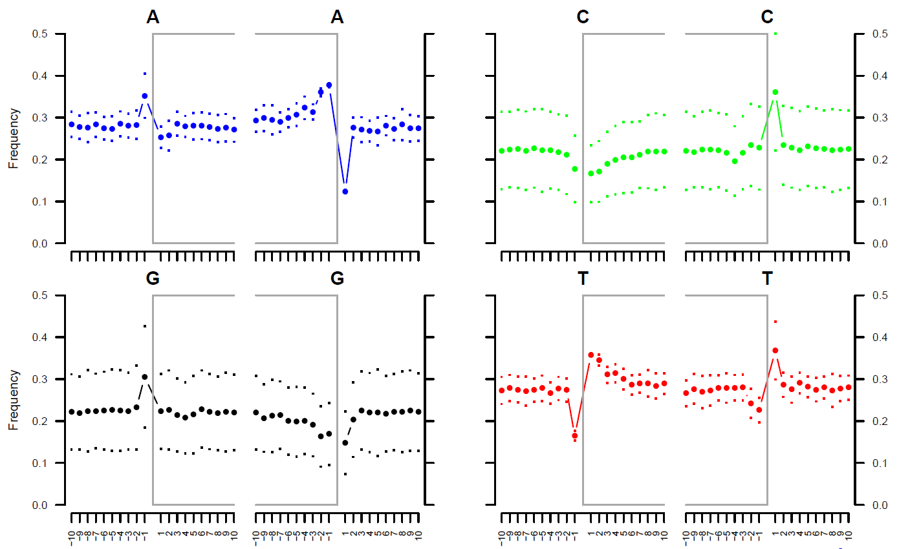
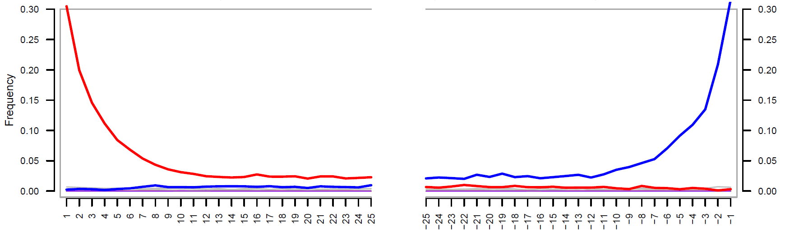

# Ancient-DNA-Damage


## Summary ancient DNA damage patterns

High nucleotide misincorporation rates can be observed as a result of severe post-mortem DNA damage. Such misincorporation patterns are instrumental to authenticate ancient sequences versus modern contaminants. Inflated cytosine deamination rates at 5′-overhangs, an increase in C -> T substitution rates toward sequencing starts and complementary increase in G -> A rates toward reads ends. Conversely, a novel procedure targeting single-stranded templates has shown elevated C -> T substitution rates at both ends. [Hákon Jónsson *et al*. 2013](https://academic.oup.com/bioinformatics/article/29/13/1682/184965), [Briggs *et al*. (2007)](https://www.pnas.org/content/104/37/14616.long)


**[mapDamage2](https://ginolhac.github.io/mapDamage/)** is a computational framework written in Python and R, which tracks and quantifies DNA damage patterns among ancient DNA sequencing reads generated by Next-Generation Sequencing platforms [Hákon Jónsson *et al*. 2013](https://academic.oup.com/bioinformatics/article/29/13/1682/184965). It used quite common in recent published ancient DNA studies.

I followed the instruction on [mapDamage2 homepage](https://ginolhac.github.io/mapDamage/) to install all requirements for mapDamage2 and then mapDamage2 itself. You can also install ```mapDamage2``` through ``conda`` using the following command:

```conda install -c bioconda mapdamage2```


### 1. Input files

The  data provided by [Maria Nieves Colón](https://github.com/mnievesc/ENAH_curso_aDNA_2019/tree/master/Ex1_aDNA_BAM), and I downloaded and deposited them in my [data](data/) folder.


**Mapped BAM file and BAI index files:**

```
# IndA means individual A

IndA.bam
IndA.bam.bai
```
The BAM file contain ancient DNA read mapped to the mitochondrial human genome (mtDNA). The reads were previously quality filtered and sorted in SAMtools. Duplicate reads and reads with multiple mappings have also been removed. The BAI file was generated using the ```samtools index``` command.

**MtDNA reference genome FASTA file:** ```rCRS.fasta``` **and index** ```rCRS.fasta.fai```.

The reference genome has been previously indexed using command ```samtools index rCRS.fasta```


### 2. Runing mapDamage2 and generate reports

```
mapDamage -i IndA.bam -r rCRS.fasta 
```
### 3. Results

**1. Fragmisincorporation_plot**

1. It shows that purines (**As** and **Gs**) are overrepresented at positions adjacent to the breaks in the ancient DNA, suggesting that depurination has contributed to its degradation. For IndA for example:



Full results [available here](data/Fragmisincorporation_plot.pdf).

2. It also displays the patterns of C -> T and G -> A changes across the DNA fragments of a given sample. For IndA for example:




 **T** reprensents by red, and **A** reprensents by blue.
 
The frequencies of the 12 possible mismatches are plotted as a function of distance from 5'-and 3'-ends. At each position, the substitution frequency, e.g., C -> T, is calculated as the proportion of human reference sequence positions carrying C where the sequencing base is T. **This means (my understanding) that given the human reference sequence positions carrying C, what is the frequency of C -> T transition? (Other possible events are C -> G, C -> A, and no mismatch C -> C)**.

Full results [available here](data/Fragmisincorporation_plot.pdf).
 
**Note**:
The main diagnostic feature documented so far is a pattern of Cytosine (C) → Thymine (T) substitutionsthat increases toward the 5′ end of the sequence reads, which in most applications, results in a complementary Guanine (G) → Adenine (A) pattern in the 3′ end caused by enzymatic repair. This pattern has been attributed to Cytosine deamination at single-stranded ends of the molecules and shows a clear tendency of increase over time in contrast to other potential diagnostic features, such as fragment length and preferential fragmentation at purines. **[Pontus Skoglund *et al*. 2014](https://www.pnas.org/content/111/6/2229)**


**Futher readings**:

[Briggs *et al*. (2007)](https://www.pnas.org/content/104/37/14616.long), Patterns of damage in genomic DNA sequences from a Neandertal.

[Dabney Jesse *et al*. (2013)](https://www.ncbi.nlm.nih.gov/pmc/articles/PMC3685887/), Ancient DNA Damage.

[Nadin Rohland *et al*. (2013)](https://www.ncbi.nlm.nih.gov/pmc/articles/PMC4275898/), Partial uracil–DNA–glycosylase treatment for screening of ancient DNA.

[My own summary](https://github.com/mianlee/Fu-s-test/tree/master/Ancient_DNA_Damage)
